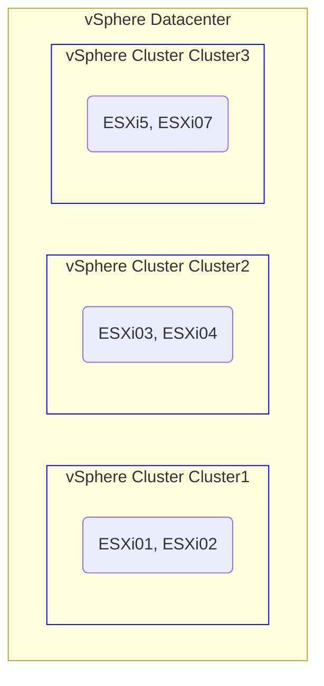

# Visualization as Code with Mermaid.js
<br>
<br>
<br>
In modern development and documentation, creating diagrams directly from code has become a powerful tool for visualizing complex ideas. [Mermaid.js](https://mermaid.js.org/) enables users to generate flowcharts, sequence diagrams, Gantt charts, and more, using simple text-based syntax. It integrates seamlessly with Markdown and various platforms like GitHub and GitLab, making it an ideal choice for technical documentation. By treating visualizations as code, Mermaid.js streamlines the process, allowing diagrams to be easily maintained and updated. This approach enhances both clarity and efficiency in visual communication.
<br>
<br>
<br>
<br>
## Goals
A concise introduction to Mermaid.js through a practical application and documented for my own reference.<br>
Here is a [PowerCLI script](https://github.com/rafaelurrutiasilva/visualization-as-code-with-mermaid.js/blob/main/powershell/Visualize-vSphere.ps1) used to interact with a vCenter instance to retrieve its vSphere datacenters, underlying clusters, and the ESXi hosts within them. This data is then visualized in a dynamic diagram using Mermaid.js, providing a clear and organized view of the infrastructure.

## Example
The code and syntax provided here serve as an example of what the result could look like.
```
flowchart TD;
    subgraph Datacenter [vSphere Datacenter <datacenterName>]
        subgraph Cluster1 [vSphere Cluster Cluster1]
            cluster-Cluster1(ESXi01, ESXi02)
            style Cluster1 stroke:blue, stroke-width:1px
        end
        subgraph Cluster2 [vSphere Cluster Cluster2]
            cluster-Cluster2(ESXi03, ESXi04)
            style Cluster2 stroke:blue, stroke-width:1px
        end
        subgraph Cluster3 [vSphere Cluster Cluster3]
            cluster-Cluster3(ESXi5, ESXi07)
            style Cluster3 stroke:blue, stroke-width:1px
        end
    end
```

## The visalization 


## Conclusion
By combining automation from your preferred programming language with Mermaid.js visualizations, you can efficiently represent complex environments in a simple and maintainable format. 
