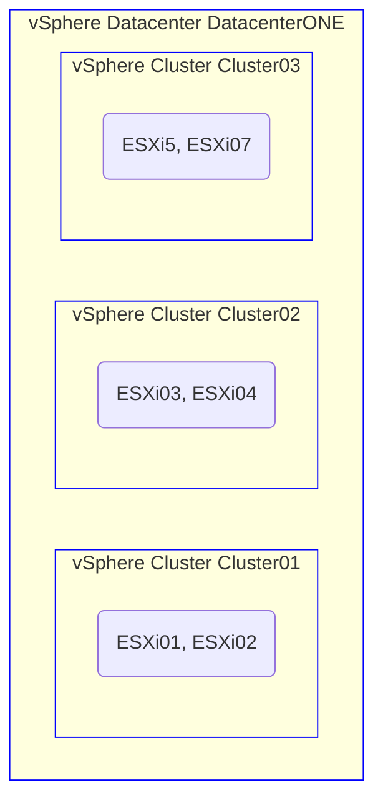

[🇸🇪 Svenska](README_se.md) / [🇬🇧 English](README.md)
# Visualisering som kod med Mermaid.js
<br> 
<br> <br> 
I modern utveckling och dokumentation har skapandet av diagram direkt från kod blivit ett kraftfullt verktyg för att visualisera komplexa idéer. 
[Mermaid.js](https://mermaid.js.org/) gör det möjligt för användare att generera flödesscheman, sekvensdiagram, Gantt-scheman och mer, med hjälp av enkel textbaserad syntax. 
Det integreras sömlöst med Markdown och olika plattformar som GitHub och GitLab, vilket gör det till ett idealiskt val för teknisk dokumentation. 
Genom att behandla visualiseringar som kod effektiviserar Mermaid.js processen, vilket gör diagramen enkla att underhålla och uppdatera. Detta tillvägagångssätt förbättrar både tydlighet och effektivitet i visuell kommunikation. 
<br> <br> <br>

## Mål
En kortfattad introduktion till Mermaid.js genom en praktisk tillämpning, dokumenterad för att fungera som referens för mig själv.

## Metod
Jag använder ett eget skapat [PowerCLI-skript](powershell/Visualize-vSphere.ps1) för att interagera med en vCenter-instans och hämta dess vSphere-datacenter, underliggande kluster och ESXi-servrar inom dem.
Denna Mermaid-kod bäddas sedan in i en HTML-sida och visualiseras som ett dynamiskt diagram med hjälp av Mermaid.js, vilket ger en tydlig och organiserad representation av infrastrukturen.

## Exempel
Koden och syntaxen som tillhandahålls här fungerar som ett exempel på hur resultatet kan se ut.
```
flowchart TD;
    subgraph Datacenter [vSphere Datacenter DatacenterONE]
        subgraph Cluster1 [vSphere Cluster Cluster01]
            cluster-Cluster1(ESXi01, ESXi02)
            style Cluster1 stroke:blue, stroke-width:1px
        end
        subgraph Cluster2 [vSphere Cluster Cluster02]
            cluster-Cluster2(ESXi03, ESXi04)
            style Cluster2 stroke:blue, stroke-width:1px
        end
        subgraph Cluster3 [vSphere Cluster Cluster03]
            cluster-Cluster3(ESXi5, ESXi07)
            style Cluster3 stroke:blue, stroke-width:1px
        end
    end
```

## Visualiseringsprocessen



